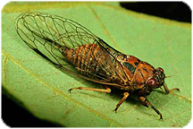

<table style='border: 0'><tr>
<td></td>
<td></td>
<td></td>
<td></td>
<td></td>
<td></td>
</tr>
<tr><td colspan="6" style="text-align: center"><ProjectStats :data="['Taxon names', 'Project sources', 'Depictions', 'Documents', 'Collection objects']"/></td></tr>
</table>

<autocomplete-otu style="width:25rem;"/>

