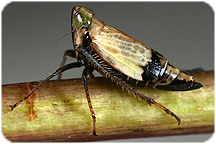
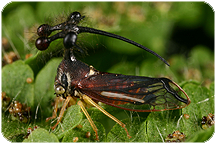
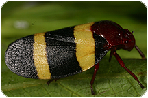
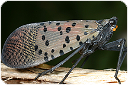

<table border='0' align='center'><tr>
<td></td>
<td></td>
<td></td>
<td></td>
<td></td>
<td></td>
</tr></table>

<table border='0' align='center'><tr><td>
<autocomplete-otu style="width:25rem;"/>
</td></tr></table>

